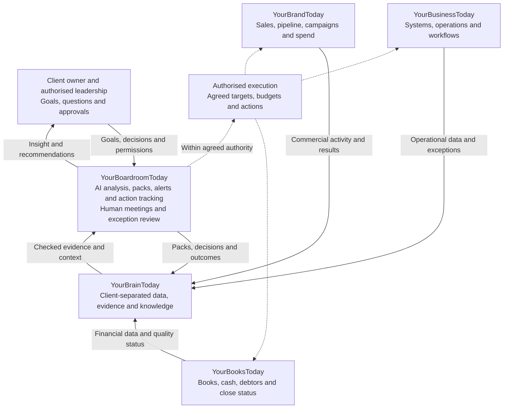

# YourBoardroomToday: Master Proposal and AI Model Handover

YourBoardroomToday is the proposed AI-led boardroom layer above the connected Today businesses. It is intended to turn current books, sales and marketing performance, operational information and the owner's goals into ongoing board-level oversight, with as much preparation and follow-through automated as possible and people involved in meetings, judgement and exceptions.

| Document control | Detail |
|---|---|
| Version | 2.1, recording Jewel Bespoke Build Ltd as the first pilot business (2.0 incorporated the Nume-inspired additions) |
| Current as at | 28 September 2026 |
| Sponsor / originator | Nigel Reilly |
| Intended audience | Directors of Your Business Today Ltd and AI models assisting with the project |
| Purpose | Director proposal, proposed project-list entry and portable development context |
| Classification | Internal business planning; not client-facing marketing or a launch commitment |
| Status | Nigel has authorised incorporating the Nume features into this proposal. Build funding, delivery ownership, pricing and launch approval remain unconfirmed |
| Supersedes | The substantive proposal content in `YourBoardroomToday_Proposal_to_Directors.pdf`, dated 26 September 2026 |
| Related earlier document | `Today_Ecosystem_Data_Flow_One_Page.pdf`; an updated text-based flow is included below |
| Distribution status | The earlier PDFs were emailed to Nigel on 26 September. This revision is held as Markdown in Nigel's `my-skills` GitHub repository; it has not been emailed or placed on the live YBT project list |

## How to read and reuse this file

This is a self-contained proposal, not a transcript and not proof that the service is already built. The confirmed direction comes from Nigel's instructions in this discussion; proposed specifications are recommendations for director review.

- **Confirmed direction:** decisions or intentions explicitly stated by Nigel.
- **Proposed specification:** how the service could be delivered; not evidence of an implemented capability.
- **Vendor-stated:** a competitor's own description, checked against the linked page on 28 September 2026; not independently tested.
- **Open decision:** something still requiring a named owner, investigation or approval.
- **Superseded wording:** earlier statements that must not be carried into new proposals or marketing.

This file deliberately contains no client records, credentials or confidential third-party financial data. Any future upload of client information to another model must be separately authorised and checked against the applicable data-handling arrangements. The one authorisation given so far is Nigel's, for Jewel Bespoke Build Ltd's own data in the pilot described under **Jewel pilot** below.

## Executive proposal

### The proposition

**Proposed positioning:** “Your business, with an AI-powered boardroom behind it: clear goals, current numbers, early warnings and accountable action, supported by people when it matters.”

The product should provide the owner with the practical controls normally associated with a well-run management board: direction, financial visibility, performance monitoring, challenge and follow-through. It should not merely produce another dashboard or imitate a group of directors talking without evidence.

- **Goals into delivery:** translate the owner's desired income, time freedom, growth and eventual exit into business targets, departmental measures and tracked actions.
- **Finance into decisions:** explain cash, profit, budgets and variances in language the owner understands.
- **Signals into intervention:** detect important changes and route them to the appropriate person before the next board meeting.
- **Meetings into execution:** prepare the pack, capture decisions, assign responsibility, follow up and measure results.
- **Joined-up services:** use the books, marketing, operations and knowledge services already included in the intended client relationship.

### Decision requested from the directors

Add YourBoardroomToday to the YBT project list and approve an initial scoping stage. The recommended approval is for service definition, architecture, delivery economics, control requirements and pilot design, not an open-ended build or public launch.

### Commercial challenge

The breadth of the idea is useful, but launching every feature at once would increase build cost, support burden and delivery risk. The recommendation is to establish a reliable reporting-and-action cycle first, then add more sophisticated forecasting, people analytics, benchmarking and peer services.

Automation should reduce routine labour, not remove accountability. Every tier must make allowance for data exceptions, quality review and support even where it includes few scheduled meetings.

## Confirmed direction from Nigel

| Date | Instruction or clarification | Effect on this proposal |
|---|---|---|
| 26 September 2026 | YourBoardroomToday is a new business initiative and a step up/add-on to YourBusinessToday | Treat it as the premium strategic layer, not a replacement for the existing service |
| 26 September 2026 | Include FD-level control of end goals, business plans, goals, targets, KPIs and other senior business support | Retain strategic financial management and broader board oversight |
| 26 September 2026 | Remove the bank-advisor section | Do not reintroduce bank advice, loan introductions or finance broking through a different label |
| 26 September 2026 | Predominantly an AI boardroom, with human meetings but as much automation as possible | Design around automated preparation and follow-through, with defined human intervention |
| 26 September 2026 | Clients will use YourBusinessToday and have their books done through YourBooksToday | Current books are part of the intended service model, not merely a client-supplied prerequisite |
| 26 September 2026 | All data will be stored on YourBrainToday | Use YourBrainToday as the governed client knowledge and data layer |
| 26 September 2026 | Sales and marketing will be looked after through YourBrandToday | Connect revenue generation and marketing activity to financial and operational results |
| 26 September 2026 | Create a five-business diagram and proposal for directors to add to the YBT project list | Include both the operating model and a ready-to-use project entry |
| 27 September 2026 | Assess what could be added from Nume | Use Nume as an additional product benchmark |
| 28 September 2026 | Add the Nume features and provide the proposal and everything as Markdown for other models | Incorporate the additions and preserve decisions, dependencies and safeguards in one portable file |
| 28 September 2026 | Jewel Bespoke Build Ltd (https://www.jewelbb.co.uk/) is the first test business; weekly reviews will run via connectors while the agent is perfected, then YBT rolls out to other companies | Jewel becomes the pilot business. The v2.0 instruction to keep this venture separate from Jewel no longer applies to this pilot |
| 28 September 2026 | Nigel's skills are stored in his `my-skills` GitHub repository only | Weekly review and other YBT skills are kept in GitHub, not in the JewelBB Portal's own skill store |

The service names and intended relationships are confirmed planning inputs. Their separate legal entities, operating readiness, integrations and current delivery capabilities have not been established by this discussion.

## Jewel pilot

**Confirmed direction (28 September 2026):** Jewel Bespoke Build Ltd is the first business YourBoardroomToday is tested on. Nigel, as Jewel's managing and finance director, authorised read access to Jewel's data for this purpose through two connectors, both confirmed connected on 28 September 2026:

- **JewelBB Portal** (`https://mcp.jewelbb.co.uk/api/mcp`): Jewel's project-management system: projects, valuations, variations, work orders, cash plan, to-dos, compliance, leads and the portal's own working rules.
- **Xero**: the organisation "Jewel Bespoke Build Ltd".

What this does and does not establish:

- Jewel's data reaches the boardroom directly from the portal and Xero. It does not run through YourBooksToday, YourBrandToday, YourBusinessToday or YourBrainToday, and the pilot does not show that those services are operational.
- Where the portal and Xero disagree, the portal's own rules decide which figure is quoted. For example, aged payables and receivables come from the portal because Xero holds some bills in draft deliberately.
- The first slice is a weekly review, run in read-only mode. The review writes nothing to the portal or Xero, and sends nothing.
- The schedule, cadence and recipients of the weekly review are not yet set.
- Using Jewel as the pilot does not make Jewel's data available to other YBT clients, benchmarking or third parties.

## The five-business ecosystem

| Business | Intended responsibility | Inputs to the boardroom | Direction returned from the boardroom |
|---|---|---|---|
| YourBooksToday | Bookkeeping and the dependable financial information layer | Reconciled accounting data, income, costs, cash, receivables, payables and close status | Investigate variances, resolve quality exceptions, report against budgets and support cash-control actions |
| YourBrandToday | Sales and marketing delivery | Campaign spend, leads, pipeline, conversion, sales activity, customer acquisition and retention indicators | Agreed commercial targets, campaign priorities, authorised budgets and performance corrections |
| YourBusinessToday | AI systems, workflows and operational improvement | Workflow status, delivery performance, capacity, process exceptions and suitable staff/operations metrics | Process changes, automation priorities, capacity actions and implementation tasks |
| YourBrainToday | Governed storage and retrieval of client data, documents, knowledge, goals and decisions | Permission-aware, dated, traceable information for reporting and analysis | Approved plans, decisions, report snapshots, outcomes and updated knowledge |
| YourBoardroomToday | AI-led strategic oversight and human-supported boardroom service | Combined evidence from the other services and the owner's objectives | Board packs, recommendations, alerts, approved actions, targets and accountability |

VAT services, payroll, statutory filings and specialist tax work were mentioned in earlier suggestions, but Nigel explicitly confirmed bookkeeping rather than the detailed YourBooksToday service catalogue. Confirm those additional scopes before representing them as included.

“All data in YourBrainToday” should mean a governed, client-specific information layer with clear source ownership. It should not create competing versions of accounting records or imply that every application must be replaced.

## Five-business data-flow diagram

### Portable text version

```text
                         CLIENT OWNER / LEADERSHIP
                  Goals, questions, choices and approvals
                                  |
                                  v
                       YOURBOARDROOMTODAY
                AI finance / sales / operations / people
                    perspectives + non-exec challenge
                Packs | Forecasts | Alerts | Decisions
                 Human meetings and exception review
                                  ^
                                  |
                 Checked data, context and source references
                                  |
                         YOURBRAINTODAY
                 Separate client data and knowledge areas
                 Sources | Goals | Plans | Actions | History
                       ^          ^          ^
                       |          |          |
          YOURBOOKSTODAY   YOURBRANDTODAY   YOURBUSINESSTODAY
          Books and cash   Sales/marketing  Systems/operations
          Costs/debtors    Leads/pipeline   Capacity/workflows
          Close status    Spend/results    Delivery/exceptions

  RETURN CYCLE:
  Boardroom recommendation -> authorised person approves ->
  responsible service executes -> result recorded in YourBrainToday ->
  next boardroom review tests whether the intended outcome happened.

  ROUTINE AUTOMATION:
  Approved schedules and low-risk workflows can run within agreed limits.
  Money movement, commitments and sensitive changes require approval.
```

### Mermaid version for compatible Markdown viewers



The diagrams are proposed logical flows, not a verified technical deployment. The text version is the fallback where a viewer does not render Mermaid.

## Benchmark influences and proposed differentiation

### The CFO Centre

The CFO Centre describes strategic, operational and financial leadership, including profit improvement, cash flow, reporting, planning, finance-team development, growth and exit preparation. Its page also includes banking, funding and FX support, which are not part of this proposal's bank-advisor-free offer ([The CFO Centre: Our Expertise](https://www.cfocentre.com/gb/our-expertise/)).

- **Borrow the discipline:** outcome-led planning, financial visibility, stronger management capability, cash control and deliberate exit preparation.
- **Adapt the delivery:** automate repeatable preparation and monitoring rather than reproduce a conventional labour-intensive fractional-CFO model.
- **Retain specialist judgement:** use suitably experienced people where the risk and subject matter justify review.
- **Keep boundaries intact:** specialist finance, transaction, tax or legal assignments would need a separately agreed scope; they are not silently included.

### Progressive Success Business Boardroom

The supplied page markets a two-day event capped at 15 participants, combining 50% boardroom masterminding and 50% intensive training, with business problem-solving and peer perspectives ([Progressive Success: Business Boardroom Mastermind](https://events.progressivesuccess.co.uk/the-business-boardroom-mastermind-application/)).

- **Borrow the interaction:** focused owner discussions, constructive challenge and working through real business problems.
- **Adapt the rhythm:** ongoing action tracking between meetings rather than relying on an event alone.
- **Keep the add-on optional:** peer sessions and an annual in-person day should not inflate the core automation workload.
- **Avoid overstatement:** the supplied page describes this event; it does not establish everything the provider does or does not offer elsewhere.

### Nume

Nume describes an AI CFO that runs personalised finance workflows, monitors financial changes, creates reports, supports budgets and scenarios, and reviews bookkeeping. Its website also lists CRM, advertising, HR and other integrations, so describing it as limited solely to accounting and bank data would be too narrow ([Nume](https://www.nume.ai/)).

- **Borrow the product discipline:** scheduled workflows, early warnings, finance quality checks, budget options and personalised reporting.
- **Extend across the business:** apply a similar operating pattern to sales, marketing, operations and the owner's longer-term goals.
- **Proposed differentiation:** combine connected managed services with the AI boardroom and accountable human meetings.
- **Evidence limit:** this is a proposed positioning distinction, not proof of a unique market offering, lower price or superior results.

## Nume-inspired additions incorporated into the proposal

These features are now part of the proposed scope for director assessment. Their inclusion in this document does not establish that they are built, commercially approved or available from launch.

| Addition | Vendor-stated benchmark | Proposed YourBoardroomToday implementation | Proposed release |
|---|---|---|---|
| Personalised action plan running in the background | “Nume creates a personalized CFO action plan and runs it automatically in the background” ([Nume](https://www.nume.ai/)) | A live 90-day boardroom plan with tasks, dependencies, owners, authorised automations, reminders and evidence of outcomes | Core pilot |
| Proactive, event-driven alerts | Nume describes 24/7 monitoring and Slack/email notifications for cash, burn, overdue invoices and financial risks ([Nume](https://www.nume.ai/)) | Material alerts after data refresh, with thresholds, deduplication and escalation; email first, Teams/WhatsApp subject to integration and consent | Core pilot; additional channels later |
| Automated bookkeeping review | Nume states “Automated bookkeeping reviews to prevent errors and surprises” ([Nume](https://www.nume.ai/)) | A quality gate on YourBooksToday data before the pack, identifying possible duplicates, missing mappings, unusual entries and reconciliation issues for human resolution | Core pilot |
| Evidence-backed financial answers | Nume says reports are “grounded in verified data” and markets “no hallucinations, no made-up numbers” ([Nume](https://www.nume.ai/)) | Source references, documented calculations, freshness labels, reconciliation checks and refusal to invent missing figures; no absolute accuracy guarantee | Core pilot |
| Three budget entry routes | Nume offers import, build-from-scratch and generation from actuals ([Nume](https://www.nume.ai/)) | Import an existing budget, guide an owner through a new budget, or generate a draft from history; all require an approved baseline | Pilot baseline; all routes in next release |
| Budget variance and scenarios | Nume lists actuals versus budget, scenario planning and real-time forecasting ([Nume](https://www.nume.ai/)) | Variance explanations, base/upside/downside forecasts and explicit assumptions; refresh on available data, not a blanket real-time promise | Baseline in pilot; advanced scenarios later |
| Shareholder and stakeholder packs | Nume describes board reports for investors or stakeholders ([Nume](https://www.nume.ai/)) | Approved, audience-specific shareholder updates built from the same reconciled figures as the internal pack | Next release |
| Personalised reporting | Nume says the platform adapts to reporting style and financial sophistication ([Nume](https://www.nume.ai/)) | Owner summary and detailed finance views, with controlled terminology, detail, cadence and preferences | Core pilot |
| Security and permission standards | Nume states read-only access, encryption, SOC-2-compliant infrastructure and no use of data for AI-model training ([Nume](https://www.nume.ai/)) | Read-only analysis by default, separate execution permissions and verified supplier/data controls; publish only what has been implemented and evidenced | Launch prerequisite |
| Low-friction introduction | Nume advertises a 14-day free trial, no credit card and five-minute setup ([Nume](https://www.nume.ai/)) | A proposed limited AI board health check using authorised data, with scope and any fee decided before launch; not a copy of a self-serve trial promise | Commercial experiment after pilot |

The source-linked audit trail and specific checks above are proposed implementation choices, not claims that Nume exposes every such control to users. WhatsApp and Teams are also proposed channels for this service, not verified Nume features from the reviewed page.

## Full proposed client service catalogue

### Owner goals, business plans and strategy

- **Owner end-goal plan:** capture desired income, working hours, role, growth ambition, succession and potential exit horizon.
- **Goal cascade:** turn that into a three-year direction, annual plan, quarterly outcomes and weekly leading indicators.
- **Business health score:** optionally summarise cash, profit, pipeline, delivery and owner dependency on a 0–100 scale, but disclose the weighting, missing inputs and component measures; this is a proposed management indicator, not an externally validated rating.
- **Business plan:** maintain a full plan and a one-page summary, with quarterly proposed updates based on actual results.
- **Budget builder:** provide the three entry routes above and maintain a version-controlled approved baseline.
- **Strategy reset:** review strengths, weaknesses, opportunities, threats, what is working, what to stop and resource constraints.
- **Market watch:** provide source-linked competitor and market updates, distinguishing observed changes from interpretation.
- **Scenario modelling:** test loss of a major client, price changes, recruitment, capacity expansion or reduced conversion before commitment.

### Financial oversight, cash and profitability

- **Management reporting:** explain profit and loss, balance sheet, cash and key variances in plain English.
- **Rolling cash forecast:** maintain a proposed 13-week view using receivables, payables, planned spend and explicit assumptions.
- **Profitability analysis:** assess jobs, products, services and customers where reliable cost allocation exists.
- **Pricing review:** flag weak margins, discount leakage and recurring underpricing for review, not automatic repricing.
- **Cost review:** identify overhead growth, unused subscriptions, duplicated spend and approaching supplier renewals.
- **Credit-control support:** prioritise overdue balances and prepare approved reminders; disputed debts follow a separate escalation route.
- **Tax and VAT reserve visibility:** show reviewed estimates and provision targets where the service scope supports them; do not imply money has actually been ring-fenced or transferred.
- **Financial quality gate:** review reconciliation status, data completeness, unusual entries and mappings before reporting.
- **Finance-team support:** issue clear exception lists, process guidance and management explanations without implying an audit opinion.

### Sales, marketing and growth

- **Pipeline oversight:** report stage movement, conversion, average deal value, sales cycle, lost reasons and concentration risk.
- **Lead-to-cash view:** connect campaign and CRM information to won work, invoicing and receipts using consistent identifiers.
- **Marketing economics:** compare spend with leads, customers, revenue and attributable contribution where the data supports it.
- **Growth requirement model:** work backwards from revenue goals to capacity, opportunities, leads and campaign requirements.
- **Client retention:** track repeat business, churn and customer concentration where meaningful.
- **Growth sprints:** agree a goal, direct YourBrandToday activity, measure results through YourBooksToday and review the outcome.
- **Independent performance commentary:** report poor performance by the Today services as openly as any other weakness.

Marketing attribution is not automatically exact merely because CRM and accounting data are connected. Reports must distinguish attributed revenue from contribution or profit, explain matching gaps and avoid presenting correlation as proven causation.

### Operations and people

- **Capacity and delivery:** compare workload, throughput, utilisation and delivery commitments with available resources.
- **Process bottlenecks:** identify repeated delays, rework, manual handoffs and automation opportunities.
- **Role and organisation design:** draft organisation charts, role scorecards and accountable ownership of processes.
- **Hiring plans:** model affordability and capacity needs before recruitment commitments.
- **Department scorecards:** provide relevant measures and routine follow-up to the managers who own them.
- **Incentive design support:** model possible KPI-linked incentives for review; do not automatically implement employment terms or payroll changes.
- **Staff pulse surveys:** optional, with privacy controls and suppression of small groups where anonymity cannot be protected.
- **Owner dependency:** identify decisions, relationships and tasks concentrated in the owner, then develop delegation and documentation plans.

People analysis should use appropriate access restrictions and must not become an automated employment-decision system. Recruitment, remuneration, disciplinary action and termination remain human decisions.

### Board operations and AI perspectives

- **AI finance perspective:** cash, margins, budgets, forecasts and financial risk.
- **AI sales and marketing perspective:** pipeline, acquisition, retention and commercial execution.
- **AI operations perspective:** capacity, systems, productivity and delivery.
- **AI people perspective:** structure, resourcing and capability.
- **AI non-executive challenge:** test assumptions, alternatives, downside and whether a decision serves the owner's goals.
- **Ask the board:** answer questions using authorised client evidence, with source references and clear uncertainty.
- **Board-pack preparation:** assemble consistent numbers, commentary, exceptions and decisions required.
- **Meeting support:** draft agendas, capture meeting content where authorised, prepare minutes and extract actions for confirmation.
- **Decision register:** preserve the decision, rationale, evidence, approver, alternatives and review date.
- **Action follow-through:** assign owners, track deadlines, chase within agreed limits and require evidence before marking completion.

The AI perspectives are analytical roles, not appointed company directors or independent qualified professionals. Several AI voices agreeing does not create independent verification; each conclusion must still be checked against evidence and calculations.

### Risk, resilience and owner freedom

- **Risk register:** maintain financial, operational, client-concentration, key-person and strategic risks with owners and mitigations.
- **Deadline tracker:** monitor agreed filings, renewals and contractual dates supplied by responsible advisers and source records.
- **Continuity planning:** explore how the business would operate if the owner or another key person were absent.
- **Exit-readiness plan:** improve documentation, reporting, recurring revenue visibility, management depth and due-diligence organisation.
- **Indicative value scenarios:** model possible value drivers with stated assumptions and ranges; do not describe this as a formal valuation.
- **Succession support:** develop handover plans, second-in-command capability and documented procedures.
- **Permissioned data room:** organise relevant evidence for a future authorised review; an organised archive is not proof of legal or sale readiness.

### Peer boardroom and additional services

- **Peer sessions:** optional small groups discussing business problems, with clear confidentiality rules.
- **Annual boardroom day:** a possible strategy and peer-learning event.
- **Community:** an optional moderated space for practical updates and discussion; avoid promising unlimited founder access.
- **Trend briefing:** source-linked changes relevant to participating businesses.
- **Benchmarking:** later-stage comparisons with suitable permissions, comparable definitions, sufficient sample sizes and privacy checks.
- **Health check:** a limited introduction to the service, clearly distinguished from a full assessment or professional assurance.

## Data, evidence and calculation design

### Proposed information architecture

- **Source systems:** retain authoritative accounting, CRM and operations records in the appropriate tools.
- **YourBrainToday records:** store authorised client data, immutable evidence snapshots where needed, mapped records, documents, goals and durable knowledge.
- **Calculation layer:** calculate financial measures with documented formulas and controlled code or spreadsheet logic, rather than letting a language model invent arithmetic.
- **AI interpretation:** explain calculated results, retrieve supporting evidence, propose questions and flag uncertainty.
- **Delivery layer:** provide dashboards, packs, alerts, meetings and action tracking.
- **Execution layer:** perform only authorised tasks through separately controlled permissions.

### Minimum fields and controls

| Record | Required information |
|---|---|
| Source item | Client, system, record identifier, relevant date, ingestion time and access classification |
| Financial metric | Definition, period, currency, basis, formula, inputs, source references and reconciliation status |
| Forecast | Actuals cutoff, assumptions, scenario, version, owner and approval status |
| Goal or KPI | Definition, target, owner, reporting interval, source and alert threshold |
| Action | Description, responsible person, due date, dependency, authority, status and completion evidence |
| Decision | Decision-maker, date, rationale, evidence, alternatives, implementation owner and review date |
| Report | Data cutoff, version, provisional/approved status, intended audience and release record |

Use actual, budget and forecast labels consistently. Reconcile ledger totals before commentary, distinguish cash from profit, and prevent stale or incomplete data from being presented as current.

### Example of evidence-backed reporting

A margin warning should identify the period and metric, show the calculation and source records, state the relevant budget or prior-period comparison, and distinguish observed causes from possible explanations. It should then recommend an investigation or action and identify who must decide, rather than assert an unsupported cause.

If the underlying data is incomplete, the correct output is a visible data-quality exception. A polished but unsupported board pack is not an acceptable fallback.

## Automation model and human controls

### Proposed operating rhythm

| Rhythm | Automated preparation | Human involvement |
|---|---|---|
| Onboarding | Consent workflow, connection checks, goals interview, draft KPI set and data-quality review | Confirm goals, scope, authority and unresolved gaps |
| After a source refresh | Refresh permitted data, recompute measures, check quality and test alert rules | Resolve material anomalies and permission exceptions |
| Weekly | Flash report, important changes, cash outlook and action status | Review significant exceptions and decisions needed |
| Monthly | Produce a draft pack after financial close/quality gates; prepare agenda and variance commentary | Required review and client meeting according to tier |
| Quarterly | Draft strategy review, updated forecasts and proposed next-quarter priorities | Confirm plan changes and resource decisions |
| Annually | Draft budget, goal review and strategy inputs | Annual planning and strategic judgement |
| After a meeting | Draft minutes and actions; retain approved decisions and follow-up schedule | Confirm material decisions before execution |

Monday morning reports, two-week KPI deterioration alerts and a seven-day first-pack target were earlier suggestions, not agreed service-level promises. Set actual timings according to data availability, delivery economics and the pilot.

### Authority boundaries

- **Automatic within policy:** data reads, deterministic calculations, report drafting, issue detection and agreed internal reminders.
- **Controlled release:** scheduled reports and alerts only after required quality checks and audience/permission checks; client-configured release rules must be explicit.
- **Human approval required:** new budgets, campaign-spend changes, pricing commitments, sensitive external communications, employment decisions and contracts.
- **Not part of this proposal:** autonomous payments, unapproved money movement, bank advice, credit broking or loan introductions.
- **Bookkeeping corrections:** the review identifies a possible issue; changes follow YourBooksToday's own authorised process, not silent alteration by the boardroom.

Alerts need severity, financial materiality, ownership, quiet hours, duplicate suppression and escalation rules. The target is useful intervention rather than constant notifications.

## Suggested client outputs

### Monthly board pack

- **Owner summary:** what changed, what matters and which decisions are needed.
- **Goal scorecard:** progress against agreed annual and quarterly outcomes.
- **Finance:** profit and loss, cash, balance-sheet issues and budget variances.
- **Forecast:** 13-week cash outlook, important assumptions and downside exposure.
- **Sales and marketing:** pipeline, conversions, campaign performance and measurement gaps.
- **Operations and people:** capacity, delivery, role or resourcing issues.
- **Risks and dependencies:** important exposures, missing information and approaching dates.
- **Decision requests:** choices, evidence, recommendation and required approver.
- **Action register:** overdue, blocked, completed and newly proposed actions.
- **Evidence appendix:** calculation definitions, source references, cutoff dates and unresolved qualifications.

### Other outputs

- **Weekly flash report:** a short summary of financial position, commercial momentum and the most important exceptions.
- **Owner summary view:** concise explanations and next actions.
- **Detailed finance view:** reconciliations, assumptions and drill-down evidence.
- **Shareholder update:** a separately approved pack with appropriate disclosure controls.
- **90-day action plan:** a live operating plan, not a static document.
- **Annual strategy pack:** agreed goals, budget, scenarios, resources and review points.

## Proposed packages and delivery economics

All packages below are discussion options. They sit above the intended connected service bundle; a books-plus-boardroom-only offer was an earlier assistant suggestion and is not Nigel's confirmed delivery model.

| Package | Proposed scope | Proposed human contact |
|---|---|---|
| Boardroom Lite | Core financial/KPI reporting, Ask the Board within supported data, source-linked pack, flash report, alerts and action tracking | Onboarding plus defined support and material-exception handling |
| Boardroom Core | Lite plus business planning, approved budget, scenario support, risk register and quarterly strategy review | Quarterly board meetings plus scoped exception support |
| Boardroom Plus | Core plus monthly board meetings, deeper strategy work, shareholder reporting where needed, and selected exit-readiness work | Monthly meetings and an annual strategy session |
| Optional add-ons | Peer boardroom, in-person day, bespoke integrations or specialist assignments | Separately scoped and priced |

No selling prices or margin promises are set. Cost the product before deciding tiers, including meetings, preparation review, data cleanup, specialist time, model usage, connectors, storage, monitoring, support and failed-workflow recovery.

- **Pricing model:** assess setup fees, recurring service charges, volume/complexity bands and change requests.
- **Scope control:** define entities, users, integrations, transaction volumes, meeting frequency and support response.
- **Existing-service accounting:** distinguish revenue and delivery cost for the boardroom from bookkeeping, marketing and systems delivery to avoid hiding unprofitable work.
- **Success measures:** track contribution per client, human time per client, support demand, retention and documented client outcomes.

## Proposed build-or-buy assessment

Assess whether an existing finance platform could provide part of the service while YourBoardroomToday owns the wider workflow and client experience. Nume is a candidate for evaluation, not a selected supplier; API access, resale rights, white-labelling, export scope and partner economics are unverified.

| Test | Questions to resolve |
|---|---|
| Financial capability | Can calculations, forecasts, periods and outputs be reconciled to the client's accounts? |
| Integration | Are the required accounting, CRM and operational connectors actually usable for the intended clients? |
| Workflow fit | Can reports, events and exceptions feed YourBrainToday and the action process? |
| Authority | Can analysis remain read-only while execution is separately approved? |
| Data control | What are hosting, retention, deletion, export, subprocessors and model-training terms? |
| Commercial rights | Are multi-client use, resale and white-labelling permitted, and on what terms? |
| Economics | What is the fully loaded per-client cost, including reviews and exception handling? |
| Reliability | What happens when a feed fails, a model changes or an output cannot be substantiated? |
| Exit route | Can client evidence, history and decisions be exported without losing meaning? |

The recommendation is a limited comparative pilot before a full custom finance-engine build. Do not assume a consumer subscription can be repackaged as a managed white-label service.

## Safeguards and launch prerequisites

These are proposed controls and due-diligence tasks, not a legal opinion or a statement of existing compliance. Assign owners and obtain relevant specialist review before client commitments.

- **Client separation:** test storage, retrieval, logs, prompts and exports for cross-client leakage.
- **Access control:** define user roles, restricted records, joiner/leaver processes and administrative permissions.
- **Supplier assurance:** verify the contractual and technical basis for encryption, retention, model-training restrictions and incident response.
- **Security claims:** do not describe the service as SOC 2 certified, “bank-grade” or guaranteed secure without evidence specific to the service.
- **Nume wording:** its website says “Built on SOC-2 compliant infrastructure”; that is not, by itself, proof that the whole product holds a particular certification ([Nume](https://www.nume.ai/)).
- **AI-data use:** make any no-training commitment only after checking every relevant provider, configuration and agreement.
- **Financial oversight:** define when experienced finance review is mandatory and who is accountable for resolving discrepancies.
- **Professional boundaries:** confirm bookkeeping, tax, statutory, legal and advisory scopes and any applicable supervision or registration before launch.
- **Insurance:** check suitable professional indemnity and cyber cover with advisers rather than assume existing cover applies.
- **Independence:** no suppression of findings about YourBooksToday, YourBrandToday or YourBusinessToday.
- **Client exit:** provide agreed exports of records, reports and decisions, subject to lawful retention and permissions.
- **Benchmarking:** do not pool client data by default; approve the basis, comparability and de-identification process first.
- **Recording and communications:** obtain appropriate authority for meeting capture, staff surveys and messaging channels.
- **Reliability:** monitor failures, backups and restores, and make missing data visible.

## Proposed delivery plan

| Stage | Work | Completion gate |
|---|---|---|
| Scope and ownership | Confirm client segment, service bundle, legal/trading structure, owners, feature priorities and budget | Directors approve a bounded scope and pilot spend |
| Data and control foundation | Establish source mapping, YourBrainToday records, permissions, metric definitions and quality checks | One test client's authorised data reconciles and isolation tests pass |
| Core boardroom | Pack, weekly report, basic cash/budget reporting, evidence-backed questions, action plan and alerts | End-to-end cycle works without unsupported figures or unauthorised actions |
| Pilot | Jewel Bespoke Build Ltd first (confirmed 28 September 2026), running weekly reviews; a second client subject to director approval | Reliability, usefulness and delivery economics demonstrated |
| Controlled launch | Finalise tiers, terms, support limits, onboarding, ownership and service promises | Directors approve launch on measured evidence |
| Expansion | Advanced scenarios, shareholder views, richer people/operations features, peer services and benchmarking | Each addition passes its own cost, evidence and control review |

### Pilot acceptance tests

- **Reconciliation:** every published headline financial measure can be reproduced from the approved source snapshot; tolerances are agreed before testing.
- **Traceability:** every material recommendation distinguishes evidence, assumption and proposed action.
- **Missing data:** deliberately broken or stale inputs result in visible qualifications, not invented figures.
- **Permissions:** users cannot retrieve other clients' information or restricted internal data.
- **Action control:** unapproved spending, record changes and external commitments are blocked.
- **Alerts:** configured triggers are tested for correct detection, duplicate suppression and routing.
- **Meeting cycle:** one meeting's approved decisions produce accountable actions and an evidence-based next review.
- **Commercial usefulness:** owners can identify the decision or action each major output supports.
- **Delivery economics:** total human time and technical costs are captured, including exceptions.
- **Portability:** a client export retains dates, definitions, source references, decisions and permission boundaries.

Numerical service targets, acceptance tolerances and financial success thresholds remain to be agreed. Do not convert these test categories into claims that testing has already passed.

## Ready-to-use YBT project-list entry

| Field | Proposed entry |
|---|---|
| Project name | YourBoardroomToday: AI-led boardroom and business oversight |
| Business context | Premium strategic layer across the connected Today services |
| Sponsor | Nigel Reilly |
| Delivery lead | To be appointed |
| Status | Proposal ready for director scoping review; Jewel pilot confirmed by Nigel; live project-list entry not confirmed |
| Objective | Convert current financial, commercial and operational evidence into goals, reports, warnings and accountable action |
| Core dependencies | YourBooksToday, YourBrandToday, YourBusinessToday and YourBrainToday, with agreed data and delivery ownership |
| First deliverable | Approved scope, architecture, build-or-buy decision and costed pilot |
| First product slice | Quality-checked monthly pack, weekly summary, cash/budget view, evidence-backed questions, alerts and action tracking |
| Explicit exclusion | Bank-advisor service, finance broking, loan introductions and autonomous money movement |
| Budget | Not yet agreed |
| Target dates | To be set after dependency and resource review |
| Pilot | Jewel Bespoke Build Ltd first, weekly reviews via the JewelBB Portal and Xero connectors; a second client subject to director approval |
| Launch gate | Evidence of reliability, data controls, client usefulness and viable delivery economics |

## Open decisions and dependencies

| Decision / check | Why it matters | Proposed owner |
|---|---|---|
| Delivery lead and executive accountability | Prevents the project being a broad idea without an accountable builder | YBT directors |
| Legal/trading structure | Defines contracting, liability, intercompany arrangements and brand ownership | Directors with advisers |
| Which services are operational | Determines the real starting point and pilot dependencies | Leads of the five services |
| Client segment and complexity | Determines metrics, integrations, implementation effort and support | Directors |
| Detailed YourBooksToday scope | Confirms whether payroll, VAT work and filings are included | Books service lead |
| Source systems | Xero was suggested earlier, not selected by Nigel as the mandatory platform. The Jewel pilot uses Xero and the JewelBB Portal because they are Jewel's systems; that does not make them mandatory for other clients | Technical and books leads |
| Finance review model | Defines competence, review thresholds and responsibility | Directors and finance lead |
| Feature priority | Prevents the entire catalogue becoming a launch commitment | Product/delivery lead |
| Human-time allowance and pricing | Determines viability of an automation-led service | Directors |
| Trial/health-check design | Defines authorised data use, scope and commercial cost | Commercial and delivery leads |
| Data/security requirements | Determines architecture, supplier suitability and client promises | Technical and data leads |
| Build versus buy | Avoids premature custom-build cost or unsuitable vendor dependency | Technical/product lead |
| Peer and benchmarking services | Requires demand, confidentiality and sufficient comparable data | Directors |
| Brand identity | Earlier PDFs used neutral navy; no approved YBT palette was established here | Directors/brand lead |
| Programme and budget | Enables realistic dates and controlled investment | Directors |

## Corrections to carry forward

The earlier proposal was useful concept work but included assertions that should not travel into another model as facts. This version corrects them while preserving the intended proposition.

- **Market uniqueness:** “not on offer elsewhere” was unsupported. Replace it with a proposed differentiation to validate.
- **Lower cost:** no pricing or delivery-cost evidence established that the service will be cheaper than every fractional CFO or competing AI platform.
- **Nume scope:** the reviewed page supports the stated features, not a categorical claim that Nume or associated services never provide human support.
- **Guaranteed accuracy:** do not adopt “no hallucinations” as an absolute promise; specify evidence, calculations, testing and visible uncertainty.
- **Security promise:** competitor marketing is not proof of our controls. Verify implementation before publishing claims.
- **Tax reserve:** a calculated provision is not the same thing as money being moved or ring-fenced.
- **Data freshness:** running the books improves control but does not eliminate reconciliation, missing invoices, accruals or late operational inputs.
- **Full automation:** a workflow that automatically drafts or checks something is not authorised to make every consequential decision.
- **Immediate ROI:** integrated data still needs matching, allocation and attribution rules.
- **Reduced-service bundle:** books-plus-boardroom alone was not the delivery model Nigel confirmed; keep the connected five-service context unless he changes it.
- **Legal status and approvals:** proposing a business is not evidence of incorporation, board approval, project-list entry or launch readiness.

## Instructions for another AI model

Paste the following instruction alongside this entire file. The file is intended to carry the working context without requiring access to the original PDFs or conversation.

```text
Use this document as the current working proposal for YourBoardroomToday,
current as at 28 September 2026.

First distinguish Nigel's confirmed direction from proposed specifications,
vendor-stated claims, open decisions and superseded wording.

Preserve the five-service model:
- YourBusinessToday: AI systems and operations.
- YourBooksToday: bookkeeping and financial information.
- YourBrandToday: sales and marketing.
- YourBrainToday: governed client data and knowledge.
- YourBoardroomToday: AI-led strategic oversight with human meetings.

The service should be automated as far as practicable, but not by allowing
unapproved spending, financial changes, employment decisions or commitments.
Keep bank advice, finance broking and loan introductions out of scope.

Include the Nume-inspired action plan, alerts, bookkeeping review, evidence-backed
answers, budget choices, variance/scenario tools, stakeholder packs, personalised
reporting, security requirements and possible introductory health check.
Treat them as proposed capabilities until implementation is evidenced.

Do not invent prices, costs, integrations, certifications, deadlines, directors,
legal entities, approval status or claims of uniqueness.
Do not assume every capability listed is part of the initial release.
Do not replace the integrated delivery model with a standalone finance chatbot.

Challenge the commercial assumptions honestly. Preserve material risks and
unresolved dependencies instead of deleting them for a cleaner sales pitch.
Maintain one authoritative source for each metric, with its definition, date,
calculation, assumptions and source reference.

Use the open decisions to ask only the questions necessary for the next task.
For external competitor, legal, security or pricing claims, recheck current
primary sources before making commitments or publishing.

Jewel Bespoke Build Ltd is the first pilot business (confirmed by Nigel,
28 September 2026). Its data is read through the JewelBB Portal and Xero
connectors for the pilot only; keep it out of other clients' work,
benchmarking and marketing. Keep this venture separate from other
independently owned businesses.
No other client financial or personal information may be disclosed to another model
or third party without the required authority and data-handling checks.

When revising this file, update its date and version, preserve the decision
history, and record which earlier statements are superseded.
Preparing a document does not authorise emailing, launching, purchasing,
publishing or changing a live project list.
```

## Revision record and next action

- **26 September 2026:** initial business outline, automation-focused service expansion, five-business model and director proposal prepared.
- **26 September 2026:** original proposal and separate diagram emailed to Nigel; this does not establish director approval.
- **27 September 2026:** Nume reviewed as an additional product benchmark and candidate feature source.
- **28 September 2026:** Nigel requested incorporation of those features and a complete portable Markdown file.
- **Version 2.0 changes:** consolidated the service catalogue, added the Nume feature mapping, updated the logical data flow, added evidence and approval controls, preserved open decisions and corrected unsupported earlier claims.
- **28 September 2026, version 2.1:** Nigel confirmed Jewel Bespoke Build Ltd as the first pilot business, with weekly reviews via the JewelBB Portal and Xero connectors, and GitHub as the only store for his skills. Added the Jewel pilot section; updated the pilot, project entry, source systems and handover instruction.
- **Superseded in 2.1:** the v2.0 handover line "Keep this venture separate from Jewel and other independently owned businesses" (now: Jewel is the pilot; other independently owned businesses stay separate), and "one or two suitable clients" as the unnamed pilot.

The next recommended step is a director scoping review that appoints a delivery lead and agrees the initial product slice, dependencies and costed pilot. Nothing in this document should be taken as approval to build or launch the full catalogue.
